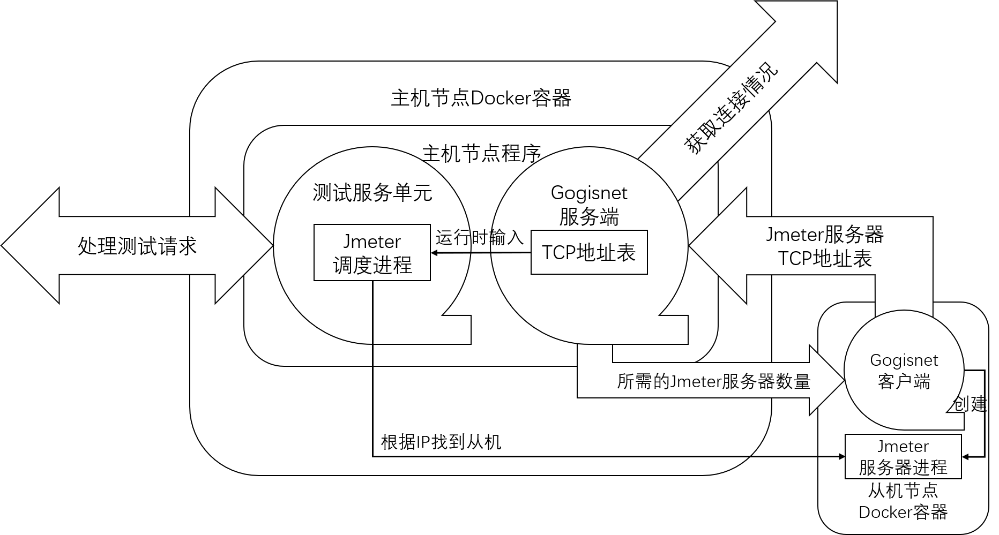

# PressureMeterNet

#### Description
一个自组织的分布式测试网络，基于Jmeter、PressureMeter 和 github.com/yindaheng98/gogisnet。

#### Software Architecture

本系统是由多个主机节点和多个从机节点自组织形成的网络。每个节点都是一个Docker容器。

从机节点容器中运行着一个Jmeter的从机进程和一个gogisnet客户端，该gogisnet客户端会将自身容器中运行着的Jmeter服务器进程的IP地址和端口号附加在gogisnet报文中发往主机节点的gogisnet服务端，从而使得该主机节点中的测试服务单元能调用到从机中的Jmeter服务器。

通过gogisnet，主机和主机之间会连成一个主机网络，且从机节点具备在某个主机失效时在网络中自行寻找新的主机进行连接的能力。



#### Installation

##### 搭建主机节点

```sh
docker build -t pressure_meter_master master
docker run -p 80:8080 pressure_meter_master -Option.ServerInfoOption.ServerID=SERVER0 -Option.ServerInfoOption.ServiceType=TYPE0
```

##### 搭建从机节点

```sh
docker build -t pressure_meter_slave slave
docker run pressure_meter_slave -Option.ClientInfoOption.ClientID=CLIENT0 -Option.ClientInfoOption.ServiceType=TYPE0 -Option.GogisnetOption.InitServerOption.BoardCastAddr=172.17.0.2
```

##### 直接使用测试docker-compose.yml

```sh
docker-compose up
```

#### Instructions

1.  xxxx
2.  xxxx
3.  xxxx

#### Contribution

1.  Fork the repository
2.  Create Feat_xxx branch
3.  Commit your code
4.  Create Pull Request


#### Gitee Feature

1.  You can use Readme\_XXX.md to support different languages, such as Readme\_en.md, Readme\_zh.md
2.  Gitee blog [blog.gitee.com](https://blog.gitee.com)
3.  Explore open source project [https://gitee.com/explore](https://gitee.com/explore)
4.  The most valuable open source project [GVP](https://gitee.com/gvp)
5.  The manual of Gitee [https://gitee.com/help](https://gitee.com/help)
6.  The most popular members  [https://gitee.com/gitee-stars/](https://gitee.com/gitee-stars/)
